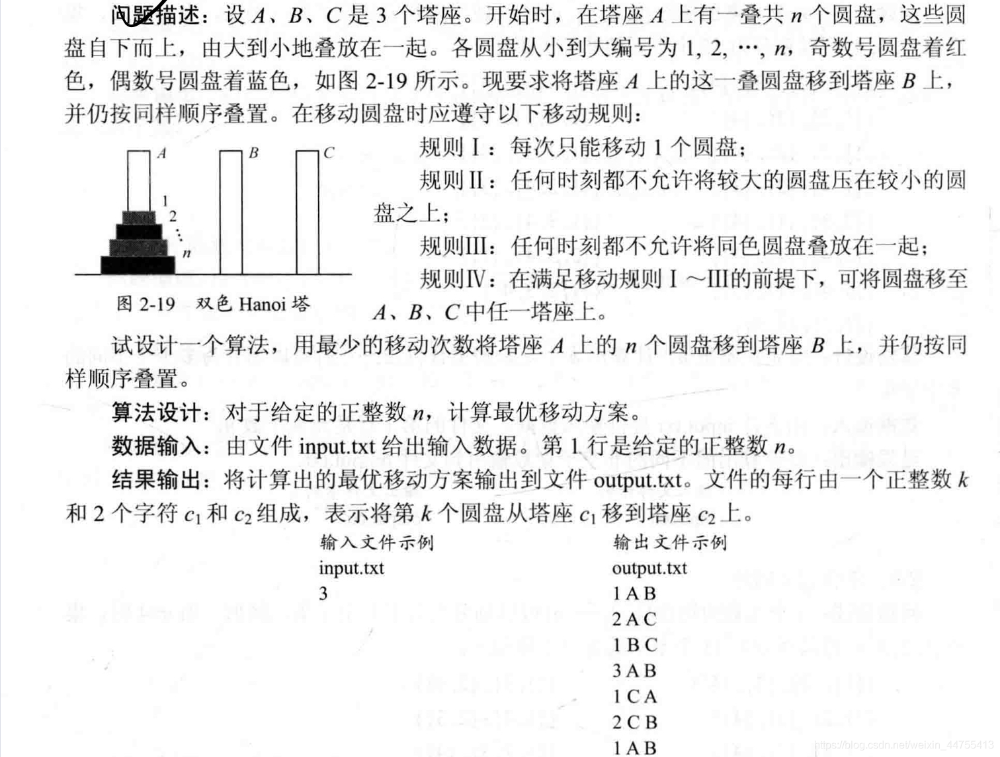

# Bicolor_Hanoi双色汉诺塔

## 问题分析

这题的实质是盘子初始编号奇偶性堆叠的问题，同奇或同偶的盘子不能放在一起，可通过把颜色信息转换为正整数的奇偶信息。若可以通过数学归纳法证明，朴素汉诺塔的最优解与此题的最优解等价。证明过程中的(1)(2)(3)三条分别为原汉诺塔的规则。

## 数学归纳法

前提声明：一共有三根塔柱A, B, C. 分别为初始塔、辅助塔、目标塔。且塔内移动规则满足题目所述。初始情况下，共有n个盘子编号$\{1,2,3,...,n\}$在A塔上。为证明方便，设函数$f(X_{tower1},Y_{tower2})$为奇偶性判断函数，同奇偶为0这是不能直接移动,不同为1这时可以直接移动。

假设：
>当$n=1$时直接从A塔移动到C塔即可。
>当$n>1$，$n=k-1$时候相邻盘子奇偶性不同，且**<u>初始塔与目标塔塔奇偶相同，初始塔与辅助塔奇偶相反</u>**。

证明：

> 当$n=k$时，
>
> (1)将k-1个盘子，从A塔借助C塔，移动到B塔是合法的。
>
> * 此时移动k-1个盘子，A塔相当于初始塔，C塔相当于辅助塔，B塔相当于目标塔。
> * 根据假设，初始塔与目标塔塔奇偶相同，初始塔与辅助塔奇偶相反。(引入假设)
> * $\Rightarrow f(A_{k-1},C_{k-1})=1,f(A_{k-1},B_{k-1})=0$
>
> * 在A塔中，$f(A_{k-1},A_k)=1$(下标表示总盘子个数时候的情况)
> * 额外的$\Rightarrow f(A_k,B_k)=1,f(A_k,C_k)=0$，证明同时满足假设条件。A塔盘移动到B塔盘合法。$_{可放在(2)中}$
>
> > 这一步完成了k-1个盘子从全局初始塔A塔到辅助塔B塔的移动
>
> (2)将第k号盘子，从初始塔A塔，移动到目标塔C塔，是合法的。
>
> * 续(1)，由于已经将所有k-1个盘子移动到B塔，此时B塔空置。
> * 根据假设中的平凡情况，可以直接移动到C塔
>
> > 这一步完成了第k个盘子从全局初始塔A塔到目标塔C塔的移动。
>
> (3)将k-1个盘子，从B塔借助A塔，移动到C塔，是合法的。
>
> * 此时B塔相当于初始塔，A塔是辅助塔，C塔是目标塔。
> * 根据假设，此时$f(B_{k-1},A_{k-1})=1,f(B_{k-1},C_{k-1})=0$。B塔盘移动到A塔盘合法。
> * 间接地，$\Rightarrow f(A_{k-1},C_{k-1})=1$。A塔盘移动到C塔盘合法。
>
> > 这一步完成了把剩下k-1个盘子从辅助塔B到目标塔C的移动。
>
> 综上三点，原朴素汉诺塔问题中的规则已经解决了奇偶编号堆放问题，也就是颜色问题。

所以用原汉诺塔的代码即可，不过这个证明能够更加深入理解汉诺塔。

