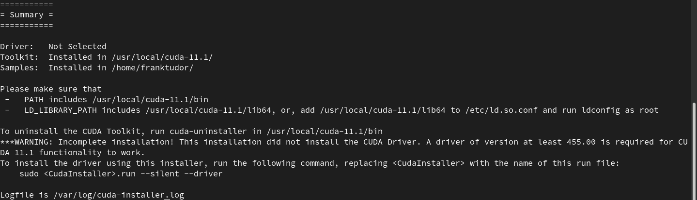

# Sunny as usual (-8.1$^{\circ}$C~-1.1$^{\circ}$C)

Exercise for a short while under the the sky of deep blue pigment frozen wind and warm sunshine. Feel so good~
***
TO GO FURTHER, trying to install the **CUDA** toolkit on the _fedora/linux_ OS. 

(Nvidia driver installed) By chance, the HOWTO guide I found just suited my system fabulously.

[Ability in need] :smile: type commands in your terminal

* `$ nvidia-smi` to check the version of my own **NVIDIA** driver version. well, it's like :

```code
+-----------------------------------------------------------------------------+
| NVIDIA-SMI 455.45.01    Driver Version: 455.45.01    CUDA Version: 11.1     |
|-------------------------------+----------------------+----------------------+
| GPU  Name        Persistence-M| Bus-Id        Disp.A | Volatile Uncorr. ECC |
| Fan  Temp  Perf  Pwr:Usage/Cap|         Memory-Usage | GPU-Util  Compute M. |
|                               |                      |               MIG M. |
|===============================+======================+======================|
|   0  GeForce GTX 105...  Off  | 00000000:01:00.0  On |                  N/A |
| N/A   43C    P8    N/A /  N/A |     44MiB /  4040MiB |     17%      Default |
|                               |                      |                  N/A |
+-------------------------------+----------------------+----------------------+
                                                                               
+-----------------------------------------------------------------------------+
| Processes:                                                                  |
|  GPU   GI   CI        PID   Type   Process name                  GPU Memory |
|        ID   ID                                                   Usage      |
|=============================================================================|
|    0   N/A  N/A      2150      G   /usr/libexec/Xorg                  41MiB |
+-----------------------------------------------------------------------------+

```

* Easy~ I search the corresponding version `.run` installer corresponding Driver Version and CUDA Version.

* Then, I found a nice tutorial webpage. In case that the link might be [`404 not found`](https://www.if-not-true-then-false.com/2018/install-nvidia-cuda-toolkit-on-fedora/) or `502 bad way`. I just narrate what happened exactly. I download the installer and run it as `sudo` then accept the all the announcements. Puffffff~ Done.

  

If you are using _mac_ OS or _Windows_ you'll never get such enlightenment and exultation after you 

* configure the environment and dependent packages
* compile the source code to executable binary files
* RUN the installer
* dada!!!! :happy: SUCCESS

​

